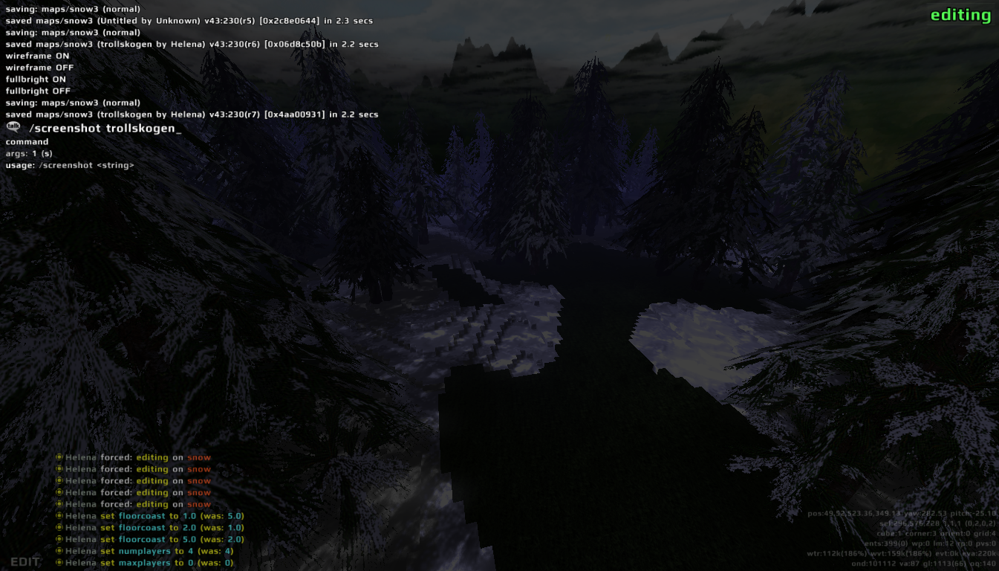
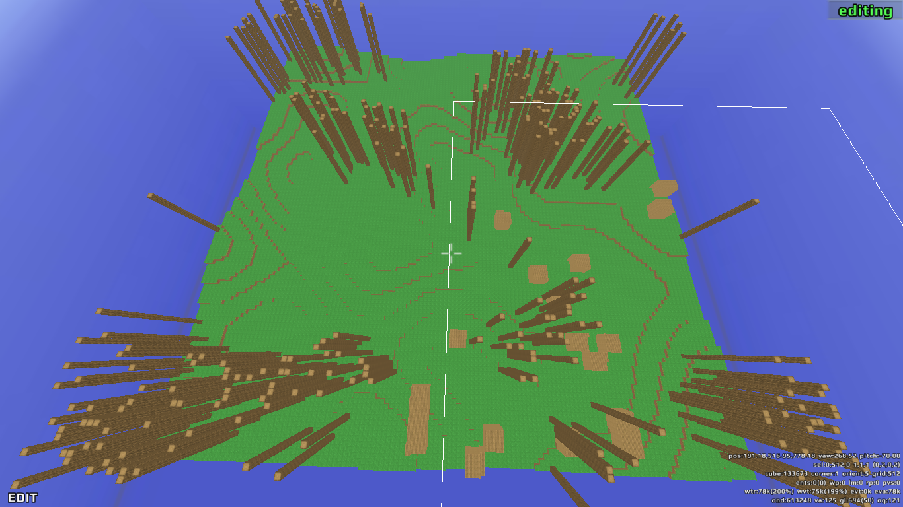

# Redeclipse map library

Library to read and write Red Eclipse maps. It isn't polished, but is "good
enough". My gaming group and I play "sniper-counter-sniper", a very unusual
mode for most people who play redeclipse. It involves stalking and sniping each
other, movement speed is nerfed, you have to listen and watch and be observant
and it can be scary as hell. This library was written to generate some new maps
for us to play on, since none of the existing maps fit extremely well with that
style of play.

Here you will find tools for parsing and writing redeclipse maps, and a
voxel→octree translation routine which allows you to construct simple voxel
worlds and have them rendered into a redeclipse octree. You could theoretically
import your minecraft world, if you wished.

## Updates

First playable map: Trollskogen



Second playable map: Bergen


Humble beginnings:



The textures in the above map were built from [havenlau's rounded pixel texture pack](http://www.minecraftforum.net/forums/mapping-and-modding/resource-packs/1237362-32x-64x-1-0-0-rounded-pixel-under-construction)

## Scripts

A couple of scripts are shipped with this library:

Script                   | Purpose
-----------              | ----
`redeclipse_iso`         | Reads and writes a map, completely unchanged. They *should* be bit-for-bit identical.
`redeclipse_to_json`     | Converts map to a JSON representation which can be operated on by other tools.
`redeclipse_from_json`   | Deserializes map back into binary representation (WIP).
`redeclipse_add_trees`   | Randomly add trees entities at z=512, across x, y in (0, 1024). Used mostly during my testing.
`redeclipse_cfg_gen`     | Given a directory, build a config file to allow using those textures.
`redeclipse_voxel_1`     | The "tutorial" script which demos adding a line of cubes at across a map diagonally.
`redeclipse_voxel_2`     | First real "test" map with automated landscape, trees, "houses".
`redeclipse_voxel_3`     | Experiments with "Pre-fab" rooms. 1) a room is placed, 2) we calculate the "doors" where we can attach another room, 3) place a new room connecting to the old, 4) repeat until satisfied.
`redeclipse_snow_forest` | Tool for building maps like trollskogen (see picture above)

## Examples

```console
$ redeclipse_voxel_2 ./test/empty.mpz ~/.redeclipse/maps/minecraft.mpz
$ redeclipse_cfg_gen my-texture-directory/ > ~/.redeclipse/maps/minecraft.cfg
```

# License

GPLv3
