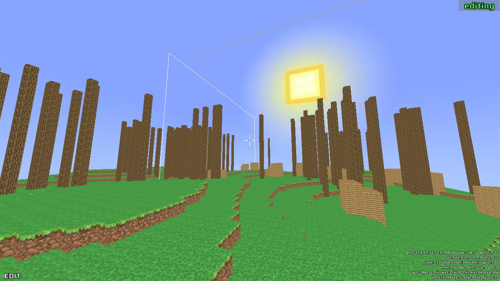

# Redeclipse map library

Library to read in Red Eclipse maps. It isn't polished, but currently will read and write very simple maps.

The end goal is to allow for automated generation of maps.

## Scripts

A couple of scripts are shipped with this library:

Script      | Purpose
----------- | ----
`re_to_json`   | Converts map to a JSON representation which can be operated on by other tools
`re_from_json` | Deserializes map back into binary representation (WIP)
`re_add_trees` | Randomly add trees entities at z=512, across x, y in (0, 1024)
`re_voxel_1` | The "tutorial" script which demos adding a line of cubes at across a map diagonally.
`re_voxel_2` | First real "test" map with automated landscape, trees, "houses".

# License

GPLv3
