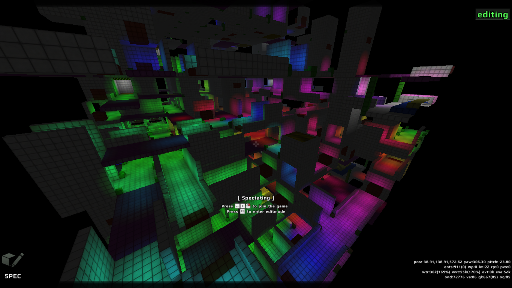
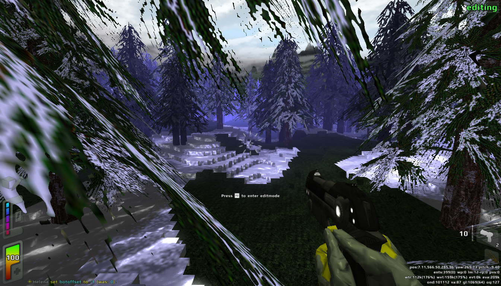
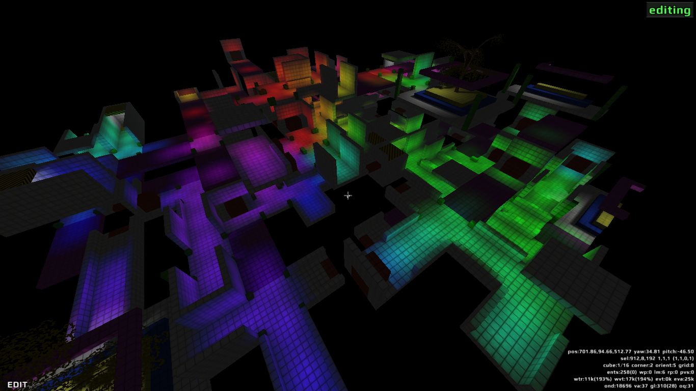
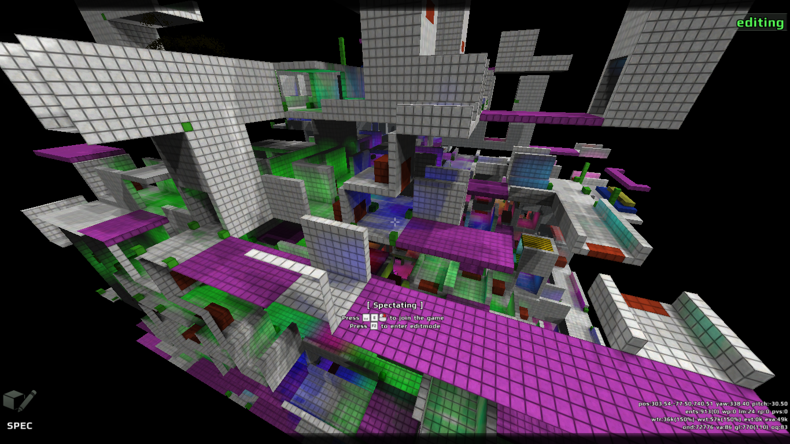
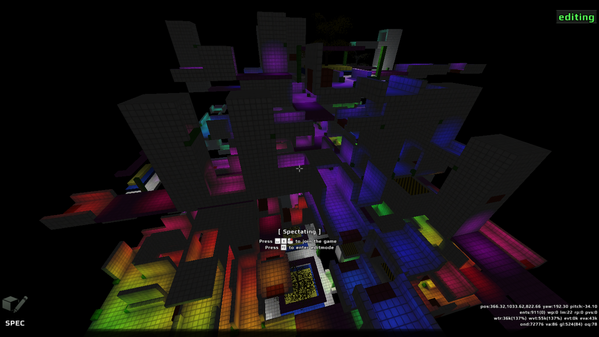
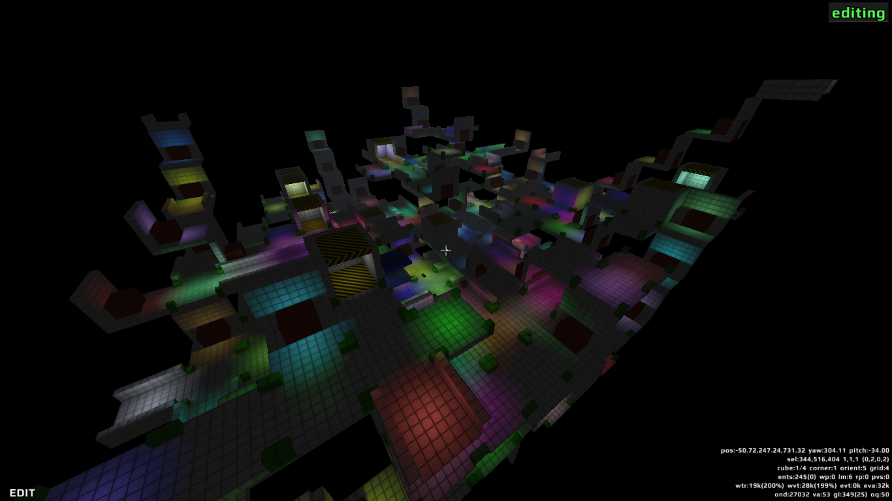

Redeclipse map library
======================

Library to read and write Red Eclipse maps. It isn't polished, but is
"good enough". My gaming group and I play "sniper-counter-sniper", a
very unusual mode for most people who play redeclipse. It involves
stalking and sniping each other, movement speed is nerfed, you have to
listen and watch and be observant and it can be scary as hell. This
library was written to generate some new maps for us to play on, since
none of the existing maps fit extremely well with that style of play.

Here you will find tools for parsing and writing redeclipse maps, and a
voxel→octree translation routine which allows you to construct simple
voxel worlds and have them rendered into a redeclipse octree. You could
theoretically import your minecraft world, if you wished.

See the `maps folder <./maps/>`__ for screenshots and maps you can play

Updates
-------

Some new features and new rooms:

.. figure:: ./maps/straumsvik.screenshot.png
   :alt: 

First enjoyable map: Trollskogen

Second enjoyable map: Bergen

Third map: Lillehammer (with day/night versions)

|image0| |image1|

Screenshots from development:

|image2| |image3|

Humble beginnings:

.. figure:: ./media/random.png
   :alt: 

The textures in the above map were built from `havenlau's rounded pixel
texture
pack <http://www.minecraftforum.net/forums/mapping-and-modding/resource-packs/1237362-32x-64x-1-0-0-rounded-pixel-under-construction>`__

Scripts
-------

A couple of scripts are shipped with this library:

+--------------+-------+
| Script       | Purpo |
|              | se    |
+==============+=======+
| ``redeclipse | Reads |
| _iso``       | and   |
|              | write |
|              | s     |
|              | a     |
|              | map,  |
|              | compl |
|              | etely |
|              | uncha |
|              | nged. |
|              | They  |
|              | *shou |
|              | ld*   |
|              | be    |
|              | bit-f |
|              | or-bi |
|              | t     |
|              | ident |
|              | ical. |
|              | Mostl |
|              | y     |
|              | used  |
|              | in    |
|              | debug |
|              | ging  |
|              | seria |
|              | lizat |
|              | ion/d |
|              | eseri |
|              | aliza |
|              | tion  |
|              | issue |
|              | s.    |
+--------------+-------+
| ``redeclipse | Conve |
| _to_json``   | rts   |
|              | map   |
|              | to a  |
|              | JSON  |
|              | repre |
|              | senta |
|              | tion  |
|              | which |
|              | can   |
|              | be    |
|              | opera |
|              | ted   |
|              | on by |
|              | other |
|              | tools |
|              | .     |
|              | (Most |
|              | ly    |
|              | a     |
|              | demo  |
|              | of    |
|              | the   |
|              | theor |
|              | etica |
|              | l     |
|              | possi |
|              | bilit |
|              | ies,  |
|              | not   |
|              | terri |
|              | bly   |
|              | usefu |
|              | l.)   |
+--------------+-------+
| ``redeclipse | Deser |
| _from_json`` | ializ |
|              | es    |
|              | map   |
|              | back  |
|              | into  |
|              | binar |
|              | y     |
|              | repre |
|              | senta |
|              | tion  |
|              | (WIP) |
|              | .     |
+--------------+-------+
| ``redeclipse | Rando |
| _add_trees`` | mly   |
|              | add   |
|              | trees |
|              | entit |
|              | ies   |
|              | at    |
|              | z=512 |
|              | ,     |
|              | acros |
|              | s     |
|              | x, y  |
|              | in    |
|              | (0,   |
|              | 1024) |
|              | .     |
|              | Used  |
|              | mostl |
|              | y     |
|              | durin |
|              | g     |
|              | my    |
|              | testi |
|              | ng.   |
+--------------+-------+
| ``redeclipse | Given |
| _cfg_gen``   | a     |
|              | direc |
|              | tory, |
|              | build |
|              | a     |
|              | confi |
|              | g     |
|              | file  |
|              | to    |
|              | allow |
|              | using |
|              | those |
|              | textu |
|              | res.  |
+--------------+-------+
| ``redeclipse | The   |
| _voxel_1``   | "tuto |
|              | rial" |
|              | scrip |
|              | t     |
|              | which |
|              | demos |
|              | addin |
|              | g     |
|              | a     |
|              | line  |
|              | of    |
|              | cubes |
|              | at    |
|              | acros |
|              | s     |
|              | a map |
|              | diago |
|              | nally |
|              | .     |
+--------------+-------+
| ``redeclipse | First |
| _voxel_2``   | real  |
|              | "test |
|              | "     |
|              | map   |
|              | with  |
|              | autom |
|              | ated  |
|              | lands |
|              | cape, |
|              | trees |
|              | ,     |
|              | "hous |
|              | es".  |
+--------------+-------+
| ``redeclipse | Exper |
| _voxel_3``   | iment |
|              | s     |
|              | with  |
|              | "Pre- |
|              | fab"  |
|              | rooms |
|              | .     |
|              | 1) a  |
|              | room  |
|              | is    |
|              | place |
|              | d,    |
|              | 2) we |
|              | calcu |
|              | late  |
|              | the   |
|              | "door |
|              | s"    |
|              | where |
|              | we    |
|              | can   |
|              | attac |
|              | h     |
|              | anoth |
|              | er    |
|              | room, |
|              | 3)    |
|              | place |
|              | a new |
|              | room  |
|              | conne |
|              | cting |
|              | to    |
|              | the   |
|              | old,  |
|              | 4)    |
|              | repea |
|              | t     |
|              | until |
|              | satis |
|              | fied. |
+--------------+-------+
| ``redeclipse | Tool  |
| _snow_forest | for   |
| ``           | build |
|              | ing   |
|              | maps  |
|              | like  |
|              | troll |
|              | skoge |
|              | n     |
|              | (see  |
|              | pictu |
|              | re    |
|              | above |
|              | )     |
+--------------+-------+

Examples
--------

.. code:: console

    $ redeclipse_voxel_2 ./test/empty.mpz ~/.redeclipse/maps/minecraft.mpz
    $ redeclipse_cfg_gen my-texture-directory/ > ~/.redeclipse/maps/minecraft.cfg

License
=======

GPLv3

.. |image2| image:: ./maps/sandvika.png

