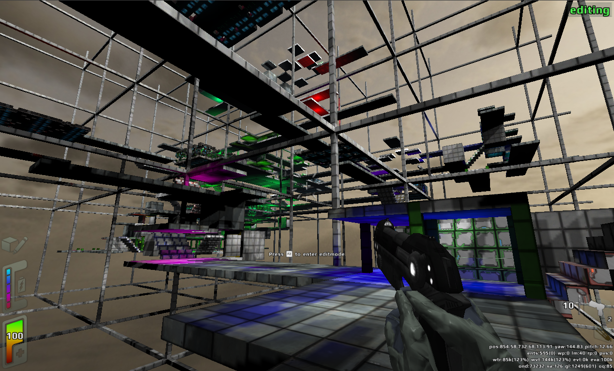
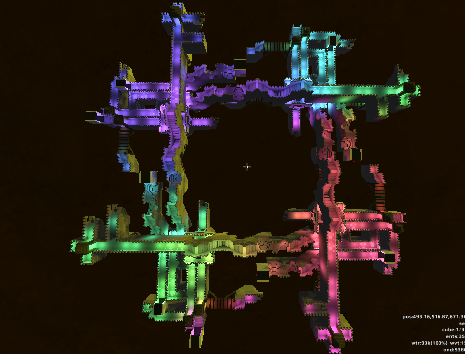

Redeclipse map library |travis| |docs|
======================================

.. |docs| image:: https://readthedocs.org/projects/remapper/badge/?version=latest
   :target: https://travis-ci.org/hexylena/remappe://remapper.readthedocs.io/en/latest/

Library to read and write Red Eclipse maps. It isn't polished, but is
"good enough". My gaming group and I play "sniper-counter-sniper", a
very unusual mode for most people who play redeclipse. It involves
stalking and sniping each other, movement speed is nerfed, you have to
listen and watch and be observant and it can be scary as hell. This
library was written to generate some new maps for us to play on, since
none of the existing maps fit extremely well with that style of play.

Here you will find tools for parsing and writing redeclipse maps, and a
voxel→octree translation routine which allows you to construct simple
voxel worlds and have them rendered into a redeclipse octree. You could
theoretically import your minecraft world, if you wished.

Updates
-------

See the `maps folder <./maps/>`__ for screenshots and assorted maps you can
play. See the `blog post <https://hexylena.github.io/2017/09/23/remapper.html>`__
for more information and a history of ``remapper``.

Examples
--------

.. code:: console

    $ virtualenv .venv
    $ pip install -r requirements.txt
    $ python setup.py develop
    $ python redeclipse/cli/magica_rooms.py maps/empty-day.mpz --seed 3 --magica out.vox --rooms 200 --mpz_out ~/.redeclipse/maps/test.mpz

License
=======

GPLv3
